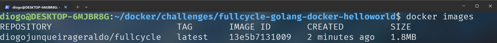

# fullcycle-golang-docker-helloworld

Simple Golang Dockerfile

## Build & Run

```sh
docker build . -t diogojunqueirageraldo/fullcycle:latest
docker run --rm diogojunqueirageraldo/fullcycle
```

## Image Size



## Docker Hub

[Docker Hub Image](https://hub.docker.com/repository/docker/diogojunqueirageraldo/fullcycle/general)


